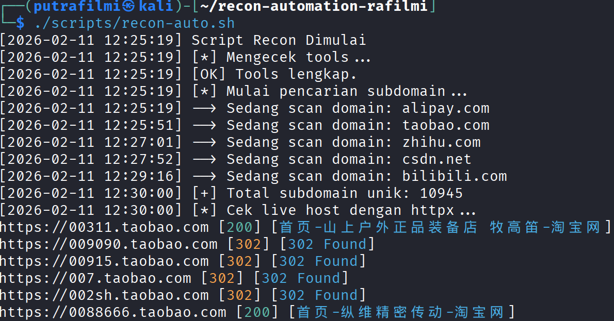
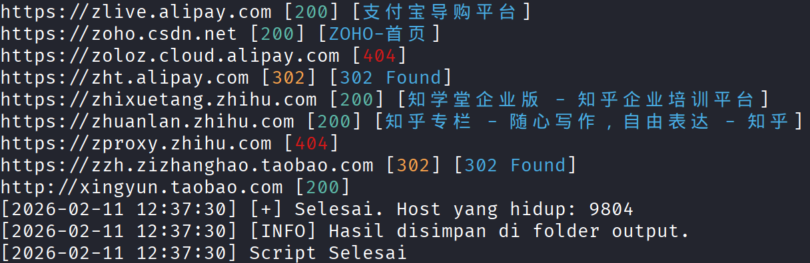

# Recon Automation Script

Script ini menjalankan proses reconnaissance otomatis mulai dari mencari subdomain sampai mengecek website yang aktif.

## Struktur Folder
- `input/`: Tempat menaruh list domain target (`domains.txt`)
- `output/`: Hasil scan (`live.txt` dan `all-subdomains.txt`)
- `scripts/`: Script utama (`recon-auto.sh`)
- `logs/`: Catatan log error dan progress

## Cara Install Tools
Pastikan sudah install Go-lang, lalu jalankan:

```bash
go install -v [github.com/projectdiscovery/subfinder/v2/cmd/subfinder@latest](https://github.com/projectdiscovery/subfinder/v2/cmd/subfinder@latest)
go install -v [github.com/projectdiscovery/httpx/cmd/httpx@latest](https://github.com/projectdiscovery/httpx/cmd/httpx@latest)
go install -v [github.com/tomnomnom/anew@latest](https://github.com/tomnomnom/anew@latest)

## Demo & Screenshot Eksekusi

Di bawah adalah dokumentasi script berjalan di terminal Kali Linux.

**1. Proses Enumerasi Subdomain**
Saat script dijalankan, diawali dengan pengecekan tools, lalu scanning domain satu per satu (Alipay, Taobao, dll). Log mencatat waktu secara *real-time*. Di tahap ini, script berhasil menemukan **10.945 subdomain unik** setelah difilter oleh `anew`.



**2. Proses Live Filtering & Hasil Akhir**
Setelah subdomain terkumpul, `httpx` melakukan probing untuk melihat status code (200, 302, 404) dan judul website. Proses selesai tanpa error dengan hasil akhir **9.804 live hosts** yang tersimpan di folder output.


